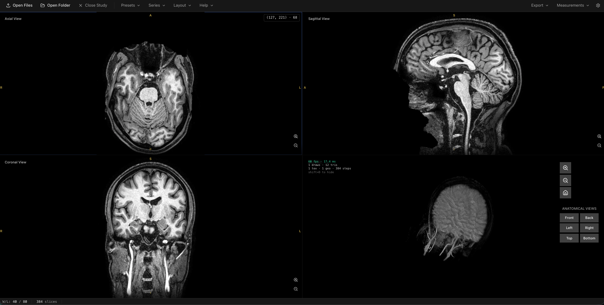

# 3D DICOM Visualiser

A modern, browser-based medical imaging viewer for visualizing DICOM files in 2D and 3D. Built with privacy in mind - all processing happens 100% client-side with no server uploads required. Free and open-source.




[LIVE DEMO](https://rage997.github.io/DICOM-Viewer/)

## Features

### Core Functionality
- **File Loading**
  - Drag-and-drop DICOM files or folders
  - Folder picker with recursive scanning
  - Multi-file batch processing with Web Workers
  - Graceful handling of missing metadata

### 2D Viewing
- **Multi-Planar Reconstruction (MPR)**
  - Axial, Sagittal, and Coronal views
  - Real-time slice navigation (scroll wheel, slider, buttons)
  - Window/Level adjustment (mouse drag)
  - Slice counter and progress indicator
  - Window/Level presets (Brain, Lung, Bone, Abdomen, Liver, Spine) with keyboard shortcuts
  - Measurements: distance (mm), angle (°), rectangle ROI (area + HU statistics)

### 3D Rendering
- **GPU Volume Rendering**
  - Real-time ray marching with WebGL2
  - Multi-segment transfer function for tissue differentiation
  - Gradient-based Phong shading for depth perception
  - Interactive camera controls (rotate, pan, zoom)
  - Adjustable opacity and rendering quality
  - Camera reset and preset buttons

### User Interface
- **Medical Imaging Workstation UI**
  - Dark theme optimized for medical imaging
  - Selectable viewport layouts (1×1, 2×2, 1+3) with click-to-focus
  - Single-slice mode for 2D-only datasets
  - Grouped toolbar menus: Presets, Layout, Help, Settings
  - Window/Level HUD and a first-run navigation guide
  - Settings panel (toolbar gear) for 3D rendering

### Privacy & Performance
- **100% Client-Side Processing**
  - No server uploads - files never leave your device
  - HIPAA-friendly architecture
  - Fast Web Worker-based DICOM parsing (4 concurrent workers)
  - Efficient Canvas2D and WebGL rendering

## Quick Start

### Prerequisites
- Node.js 18+
- Modern browser with WebGL2 support
- If browser supports WebGPU, it automatically switches to it

### Installation

```bash
# Clone the repository
git clone https://github.com/yourusername/3d-dicom-visualiser.git
cd 3d-dicom-visualiser

# Install dependencies
npm install

# Start development server
npm run dev
```

The app will be available at `http://localhost:8050`

### Usage

1. **Load DICOM files:**
   - Drag-and-drop a folder containing DICOM files onto the viewport
   - Or click "Open Folder" and select a directory
   - Or use "Open Files" to select individual files

2. **Navigate 2D slices:**
   - Scroll to navigate through slices
   - Drag slider or use prev/next buttons
   - Left-drag on image to adjust brightness/contrast (Window/Level)
   - Arrow keys on the hovered view: **Left/Right** change slice, **Up/Down** adjust brightness
   - Press **1–6** to apply Window/Level presets (Brain, Lung, Bone, Abdomen, Liver, Spine)

3. **Interact with 3D view:**
   - Left-drag to rotate
   - Right-drag to pan
   - Scroll to zoom
   - Open **Settings** (gear icon) to adjust 3D opacity, brightness, and quality
   - Click "Reset View" to return to default camera position

4. **Switch layouts:** Use the **Layout** menu (1×1, 2×2, 1+3); click any pane to make it the primary view.

5. **Measure:** Open the **Measurements** menu, pick Distance / Angle / ROI, click to place points, drag handles to adjust, and press Esc to finish.

## Technology Stack

- **Frontend:** React 18.3, TypeScript 5.6
- **Build Tool:** Vite 5.4
- **Styling:** TailwindCSS 3.4
- **3D Rendering:** Three.js 0.170 (WebGL2)
- **DICOM Parsing:** dcmjs 0.30
- **State Management:** Zustand 5.0
- **Testing:** Vitest 4.1 + Testing Library

## Testing

```bash
# Run all tests
npm run test

# Run tests in watch mode
npm run test:watch

# Generate coverage report
npm run test:coverage

# Type check
npm run type-check
```

**Current Status:** 126 tests passing, 2 skipped (unit); e2e specs run via `yarn test:e2e`

## Building for Production

```bash
# Build for production
npm run build

# Preview production build
npm run preview
```

Output will be in the `dist/` directory. Serve with any static file host (Vercel, Netlify, GitHub Pages, etc.).

## Project Structure

```
src/
├── app/                    # Main application component
├── components/             # React components
│   ├── common/            # Shared UI components
│   ├── layout/            # Layout components (toolbar, status bar)
│   └── viewer/            # Viewer components (viewport, canvas, controls)
├── features/              # Feature modules
│   ├── dicom/             # DICOM loading and parsing
│   │   ├── loader/        # File I/O
│   │   └── study/         # Study reconstruction
│   └── viewer/            # Rendering engines
│       ├── controls/      # Camera controls
│       ├── slice/         # 2D slice renderer
│       └── volume/        # 3D volume renderer
├── hooks/                 # React hooks
├── state/                 # Zustand store
├── types/                 # TypeScript type definitions
├── utils/                 # Utility functions
└── workers/               # Web Workers
```

## Roadmap

- [x] DICOM file loading and parsing
- [x] Study reconstruction and series detection
- [x] 2D MPR views (axial, sagittal, coronal)
- [x] 3D volume rendering with ray marching
- [x] Interactive slice navigation and Window/Level
- [x] Camera controls and 3D settings panel
- [x] Folder drag-and-drop support
- [x] Graceful degradation for incomplete metadata
- [x] Window/Level presets (Brain, Lung, Bone, Abdomen, Liver, Spine)
- [x] Keyboard shortcuts for slice navigation and presets
- [x] Window/Level preset dropdown, Help & Settings menus
- [x] Selectable viewport layouts (1×1, 2×2, 1+3)
- [x] Measurements tool (distance, angle, ROI)
- [ ] Color transfer functions
- [ ] MIP (Maximum Intensity Projection) rendering
- [ ] Clipping planes for 3D view
- [ ] Multi-study comparison
- [ ] Export capabilities (PNG, DICOM SR)

## Contributing

I welcome contributions but please follow these guidelines:

1. Fork the repository
2. Create a feature branch (`git checkout -b feature/amazing-feature`)
3. Make your changes and add tests
4. Ensure all tests pass (`npm run test`)
5. Commit with a descriptive message
6. Push to your fork and submit a pull request

### Development Guidelines
- Write TypeScript with strict type checking
- Add tests for new features
- Follow existing code style
- Update documentation as needed
- Keep commits focused and atomic

## License

MIT License - see [LICENSE](LICENSE) file for details

**Note:** This software is for educational and research purposes. It is not FDA-approved or intended for clinical diagnosis.
